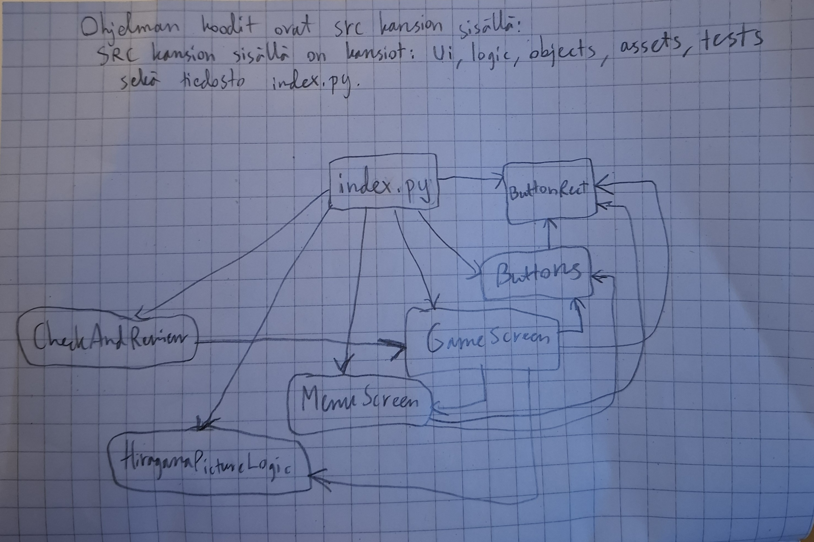

# Arkkitehtuuri (luokkakaavio)

Tässä kuva, jossa on ohjelman luokkakaavio.

Ohjelma koostuu kansioista. Ohjelma on "src" -nimisen kansion sisällä. Tämän kansion sisällä on kansioita:
-logic (sisältää kaiken logiikkaa koskevan koodin)
-ui (sisältää kaiken ohjelman käyttöliittymää koskevan koodin)
-objects (erilaisia käyttöliittymään käytettäviä palasia, kuten koodi, miten tehdään suorakulmio ohjelman napeille)
-assets (ulkopuoliset kirjastot, kuvat yms.)

